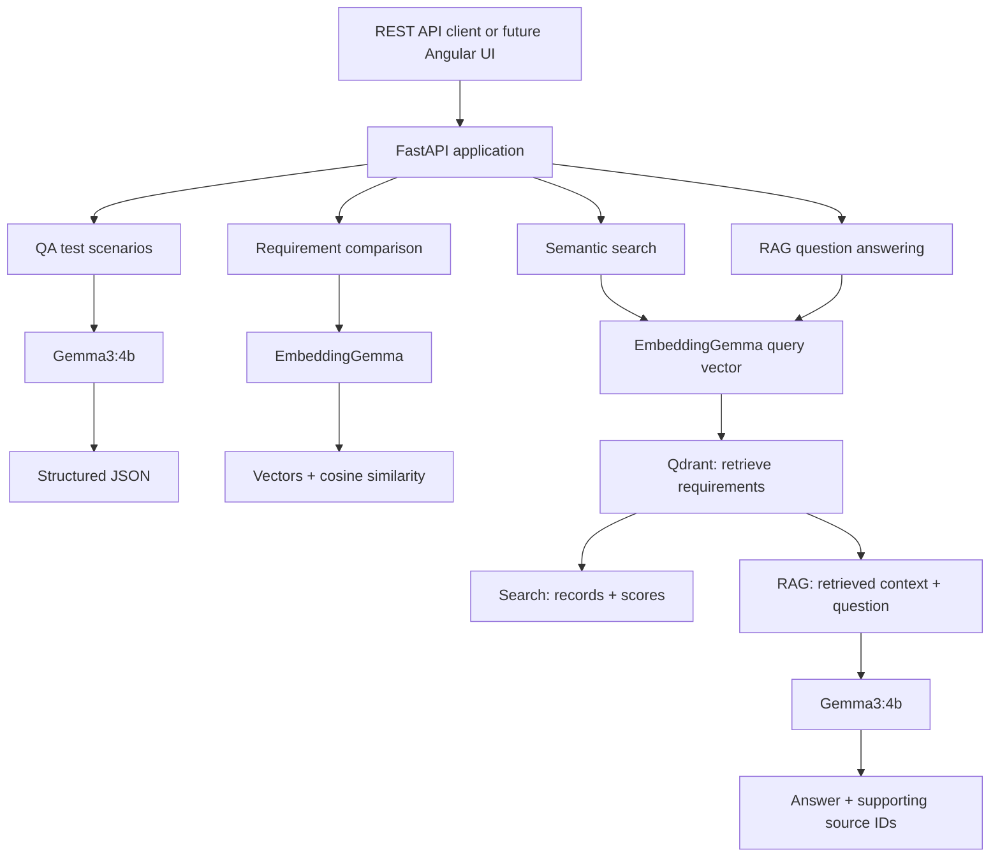

# Local LLM Application Engineering Agent

A local AI-assisted engineering application built with Python, FastAPI, Ollama, Gemma, and embedding models.

This project demonstrates how local AI models can be accessed through Python and exposed through REST APIs. It provides two controlled AI-assisted engineering capabilities:

* Structured QA test-scenario generation from software requirements
* Semantic requirement comparison using embeddings and cosine similarity

## Current capabilities

The original QA and comparison capabilities are retained below. Later update sections document Qdrant storage, semantic search, RAG, logging, and the current environment-based configuration.

* Python client for Ollama's local APIs
* Local `gemma3:1b` integration for text generation
* Local `embeddinggemma` integration for semantic similarity
* Role-based prompting with fixed `system` instructions and user-provided requirements
* Conversation-history support using ordered messages
* Configurable LLM generation settings: context window, temperature, seed, and token limit
* HTTP error handling for Ollama API calls
* FastAPI server with REST endpoints
* Interactive API documentation through FastAPI Swagger UI
* AI endpoint that generates test scenarios from a software requirement
* Semantic-similarity endpoint that compares two requirements
* Request and response validation using Pydantic models
* Markdown code-fence cleanup, trailing-comma cleanup, JSON parsing, and response validation for local model responses
* Controlled `502` error responses for malformed local-model output

## Technology stack

* Python
* FastAPI
* Uvicorn
* Ollama
* Gemma 3
* EmbeddingGemma
* Requests
* Pydantic

## Local models and responsibilities

The FastAPI backend selects the appropriate local model for each endpoint. API clients do not select models directly.

| Model            | Purpose                                                                   | Endpoint                               |
| ---------------- | ------------------------------------------------------------------------- | -------------------------------------- |
| `gemma3:1b`      | Generates structured QA test-scenario drafts                              | `POST /api/ai/generate-test-scenarios` |
| `embeddinggemma` | Converts requirement text into vectors for semantic similarity comparison | `POST /api/ai/compare-requirements`    |

## Architecture



Requirement storage through `/requirements` supplies the vectors and metadata that Qdrant retrieves.

* `/requirements` generates an embedding and stores the vector and requirement metadata in Qdrant.
* `/search_requirement` embeds the query and returns the nearest stored requirements with similarity scores. It does not call the chat model.
* `/ask` performs the same retrieval, includes the retrieved requirement text and IDs in the prompt, and calls `gemma3:4b` to generate an answer with supporting source IDs. This retrieval followed by generation is the RAG flow.
* QA scenario generation calls the chat model directly, while pairwise requirement comparison uses embeddings and cosine similarity without Qdrant retrieval.

The chat model is selected through `OLLAMA_CHAT_MODEL` in `.env`; the current setting is `gemma3:4b`. Earlier `gemma3:1b` examples describe the original setup.

## Prerequisites

* Python 3.10 or later
* [Ollama](https://ollama.com/)
* Local Gemma and embedding models

Install the required Python packages:

```powershell
py -m pip install requests
py -m pip install "fastapi[standard]"
```

Download the local models:

```powershell
ollama pull gemma3:1b
ollama pull embeddinggemma
```

## Run the FastAPI application

Ensure Ollama is running. From the `backend` folder, run:

```powershell
py -m uvicorn main:app --reload
```

The application starts locally at:

```text
http://127.0.0.1:8000
```

Open the interactive API documentation at:

```text
http://127.0.0.1:8000/docs
```

## Current REST endpoints

| Method | Endpoint                          | Purpose                                                          |
| ------ | --------------------------------- | ---------------------------------------------------------------- |
| GET    | `/health`                         | Confirms that the FastAPI application is running                 |
| GET    | `/api/v1/tasks`                   | Returns all sample tasks                                         |
| GET    | `/api/v1/tasks/{task_id}`         | Returns one task by ID                                           |
| POST   | `/api/v1/tasks`                   | Creates a sample task                                            |
| PUT    | `/api/v1/tasks/{task_id}`         | Updates a task status                                            |
| DELETE | `/api/v1/tasks/{task_id}`         | Deletes a sample task                                            |
| POST   | `/api/ai/generate-test-scenarios` | Generates QA test-scenario drafts using local Gemma              |
| POST   | `/api/ai/compare-requirements`    | Compares two requirements using embeddings and cosine similarity |

The task endpoints currently use in-memory sample data. The data resets whenever the server restarts.

## Generate test scenarios with the local LLM

Send a `POST` request to:

```text
/api/ai/generate-test-scenarios
```

The API applies a fixed QA system prompt in the backend. The client supplies only the business requirement and optional generation settings.

Example request:

```json
{
  "requirement": "Users can log in using a registered email address and correct password.",
  "options": {
    "num_ctx": 4096,
    "temperature": 0,
    "seed": 42,
    "num_predict": 800
  }
}
```

The `requirement` field is required. The `options` field is optional; backend defaults are used when it is omitted.

The endpoint returns exactly five validated test scenarios. If the local model returns malformed JSON or an invalid test-scenario structure, the API returns a controlled `502` error response.

Example response:

```json
{
  "test_scenarios": [
    {
      "scenario_id": "1",
      "scenario_name": "Valid Login - Successful Access",
      "description": "Verify a registered user can log in with a valid email address and correct password.",
      "steps": [
        "Enter a registered email address.",
        "Enter the correct password.",
        "Click the Login button."
      ],
      "expected_result": "The user is authenticated and redirected to the dashboard."
    },
    {
      "scenario_id": "2",
      "scenario_name": "Incorrect Password - Login Failure",
      "description": "Verify login is rejected when an incorrect password is entered.",
      "steps": [
        "Enter a registered email address.",
        "Enter an incorrect password.",
        "Click the Login button."
      ],
      "expected_result": "Login is rejected and a generic invalid-credentials message is displayed."
    }
  ]
}
```

## Compare requirements with semantic similarity

Send a `POST` request to:

```text
/api/ai/compare-requirements
```

The endpoint uses `embeddinggemma` to convert both requirements into numerical vectors. It then calculates their cosine similarity score.

Cosine similarity compares the semantic meaning of the two texts. A higher score generally indicates more similar requirements. Scores are most useful when comparing complete requirements rather than very short words or names.

Example request with related requirements:

```json
{
  "requirement_a": "Users can reset a forgotten password using an email link.",
  "requirement_b": "Allow customers to change their password through email verification."
}
```

Example response:

```json
{
  "similarity_score": 0.53,
  "interpretation": "Moderately similar requirements"
}
```

Example request with unrelated requirements:

```json
{
  "requirement_a": "Users can reset a forgotten password using an email link.",
  "requirement_b": "Administrators can export monthly sales reports to CSV."
}
```

Example response:

```json
{
  "similarity_score": 0.28,
  "interpretation": "Low similarity"
}
```

Similarity scores may vary slightly based on the local embedding model and the supplied text.

## Run the local Ollama chat client

Ensure Ollama is running. From the `backend` folder, run:

```powershell
py .\interactive_ollama_system_user_prompt.py
```

The client sends role-based messages to the local Gemma model and prints the generated response.

## Current scope

This project is a local LLM and FastAPI REST API foundation with initial AI-assisted QA and semantic-similarity capabilities. It is not yet a fully autonomous AI agent or a production-ready service.

Generated test scenarios are drafts intended for human review. Semantic-similarity scores are intended to help identify potentially related requirements; they do not replace engineering review.

## Planned enhancements

* [ ] Add unit and API tests
* [ ] Generate requirement specifications and other AI-assisted engineering drafts
* [ ] Add an Angular user interface
* [x] Add rotating file logging and dependency-failure diagnostics
* [ ] Extend health/readiness checks to cover dependencies
* [ ] Store tasks and reviewed AI outputs in a database
* [x] Add semantic search across a stored requirement collection
* [x] Add RAG answers using retrieved requirements
* [ ] Add human-review workflows
* [ ] Add Docker support
* [ ] Add Kubernetes deployment configuration

## Why local AI models?

Running Gemma and embedding models locally through Ollama supports private experimentation with AI application development and avoids reliance on external model APIs during early development.

The project provides a practical foundation for evaluating local model integration, prompt handling, structured outputs, semantic similarity, and controlled AI-assisted engineering workflows.

## Update: Qdrant requirement storage and retrieval

The original sections above document the project's first capabilities and examples. Since then, requirement storage and semantic retrieval have been implemented and checked through the FastAPI Swagger UI and Qdrant dashboard. The earlier planned item “Add semantic search across a stored requirement collection” is now implemented. The following setup instructions and examples extend the original documentation.

### Software installation for the new capability

The project needs **Python 3.10+**, **Ollama**, and **Podman**. The original installation commands above install Requests and FastAPI and download `gemma3:1b` and `embeddinggemma`. Install the additional Python package for Qdrant from the `backend` directory:

```powershell
py -m pip install qdrant-client
```

For a fresh installation, run all of the Python package commands together:

```powershell
py -m pip install requests "fastapi[standard]" qdrant-client pydantic-settings
```

With Ollama installed and running, download the models if you have not already done so:

```powershell
ollama pull gemma3:1b
ollama pull embeddinggemma
```

Install Podman and start its machine on Windows. If this is your first Podman run, use `podman machine init` once before starting it. Pull the Qdrant image, create a named volume for persistent data, and start the container:

```powershell
podman machine start
podman pull docker.io/qdrant/qdrant:latest
podman volume create qdrant_storage
podman run -d --name qdrant -p 6333:6333 -v qdrant_storage:/qdrant/storage docker.io/qdrant/qdrant:latest
```

On later runs, start the existing container with `podman start qdrant` instead of repeating `podman run`. Qdrant's API is at <http://localhost:6333>, and its dashboard is at <http://localhost:6333/dashboard>. The named volume keeps Qdrant's data when the container stops.

Once Ollama and Qdrant are running, start FastAPI from the `backend` folder as shown earlier:

```powershell
py -m uvicorn main:app --reload
```

Open <http://127.0.0.1:8000/docs> to try the endpoints.

### FastAPI routers

The requirement routes live in `qdrant_requirement_store.py`. That file defines a FastAPI `APIRouter`, and `main.py` includes it in the main application. For example, if both files are in the `backend` directory:

```python
# main.py — add these lines alongside the existing app and routes
from qdrant_requirement_store import router as requirement_router

app.include_router(requirement_router)
```

The route file uses the same router for both operations:

```python
# qdrant_requirement_store.py — abbreviated registration example
from fastapi import APIRouter

router = APIRouter(prefix="/api/ai", tags=["AI"])

@router.post("/requirements")
def save_requirement(data):
    ...

@router.post("/search_requirement")
def search_requirements(data):
    ...
```

In your actual `main.py`, keep the existing `app = FastAPI()` and existing endpoints. Add `app.include_router(requirement_router)` **after** creating the app. If your router already has `/api/ai` in its route paths, do not add that prefix a second time. The new endpoints should appear in `/docs`.

### REST endpoints added

| Method | Endpoint | Purpose |
| --- | --- | --- |
| POST | `/api/ai/requirements` | Generate an EmbeddingGemma vector and upsert a requirement with its ID and team in Qdrant |
| POST | `/api/ai/search_requirement` | Embed search text and return top similar stored requirements with Qdrant scores |

These endpoints extend the original REST endpoint table above. A requirement is stored as one Qdrant point: its vector comes from `embeddinggemma`, while the original fields live in the point payload. Search uses the **same** embedding model. Qdrant computes similarity using the collection's cosine distance setting. The `/search_requirement` endpoint performs retrieval only. The separate `/ask` endpoint generates a RAG answer from retrieved requirements, as described below.

### Example: store two requirements

Submit this body to `POST /api/ai/requirements` in Swagger UI:

```json
{
  "requirement_id": "101",
  "team": "Accounts",
  "requirement": "Users can reset a forgotten password using an email link."
}
```

PowerShell alternative:

```powershell
$requirement = @{
    requirement_id = "101"
    team = "Accounts"
    requirement = "Users can reset a forgotten password using an email link."
} | ConvertTo-Json
Invoke-RestMethod -Method Post -Uri "http://127.0.0.1:8000/api/ai/requirements" -ContentType "application/json" -Body $requirement
```

Example success response **if your route returns the `stored` flag** (the exact response depends on your implementation):

```json
{
  "requirement_id": "101",
  "stored": true
}
```

Store a second, unrelated requirement through the same endpoint:

```json
{
  "requirement_id": "102",
  "team": "Reports",
  "requirement": "Administrators can export monthly sales reports to CSV."
}
```

Open <http://localhost:6333/dashboard> and inspect the requirement collection. To view stored IDs and payloads without printing the long embedding vectors, use the dashboard Console:

```http
POST /collections/requirements/points/scroll
```

```json
{
  "limit": 10,
  "with_payload": true,
  "with_vector": false
}
```

Replace `requirements` in the URL if the collection has a different name in your code. If the point IDs are stable, saving the same `requirement_id` again updates its existing point rather than raising the count.

### Example: search stored requirements

Submit this body to `POST /api/ai/search_requirement`:

```json
{
  "query": "A customer forgot their password and needs an email reset link.",
  "limit": 2
}
```

PowerShell alternative:

```powershell
$search = @{
    query = "A customer forgot their password and needs an email reset link."
    limit = 2
} | ConvertTo-Json
Invoke-RestMethod -Method Post -Uri "http://127.0.0.1:8000/api/ai/search_requirement" -ContentType "application/json" -Body $search
```

Example **illustrative** result when the two requirements above are stored; the exact scores and response shape depend on your data and route implementation:

```json
[
  {
    "score": 0.82,
    "requirement_id": "101",
    "team": "Accounts",
    "requirement": "Users can reset a forgotten password using an email link."
  },
  {
    "score": 0.18,
    "requirement_id": "102",
    "team": "Reports",
    "requirement": "Administrators can export monthly sales reports to CSV."
  }
]
```

The password reset requirement should generally rank above the unrelated export requirement. Scores are similarity measures, not percentages or a guarantee of equivalent meaning. If no requirements have been stored, search has no stored points to return.


## Update: environment-based configuration

Service URLs, collection name, model names, and Ollama request timeout are loaded through a shared Pydantic settings object instead of being hardcoded in API calls. The current chat-model setting is `gemma3:4b`; earlier `gemma3:1b` examples above describe the original integration.

### Install the settings dependency

```powershell
py -m pip install pydantic-settings
```

Include `pydantic-settings` in the project's dependency file so fresh installations include it.

### Create the local environment file

From the project root, copy the committed template:

```powershell
Copy-Item backend/.env.example backend/.env
```

The template and local file use these keys:

```dotenv
QDRANT_URL=http://localhost:6333
QDRANT_COLLECTION=requirements
OLLAMA_URL=http://localhost:11434
OLLAMA_CHAT_MODEL=gemma3:4b
OLLAMA_EMBED_MODEL=embeddinggemma
OLLAMA_TIMEOUT_SECONDS=120
```

`backend/setting.py` defines `Settings(BaseSettings)` and exports `settings = Settings()`. It loads `.env` from its own directory, regardless of the terminal's working directory. Application modules import it with `from setting import settings`. If the file is renamed to `settings.py`, change imports to `from settings import settings`.

All six values are required and validated during startup. The timeout must be a positive integer. Existing process environment variables override `.env` values. Restart FastAPI after configuration changes; `.env` changes alone may not trigger automatic reload.

### How to use `.env.example` and `.env`

`.env.example` is the shared configuration template. Copy it to create your own `.env`; keep the template in place so other developers can use it too.

1. After cloning the repository, open PowerShell in the project root.
2. If `backend/.env` does not already exist, create it from the template:

   ```powershell
   Copy-Item backend/.env.example backend/.env
   ```

3. Open your local configuration file:

   ```powershell
   notepad backend/.env
   ```

4. Adjust the service URLs, collection name, model names, and timeout for your local setup. Save the file with the exact name `.env`, not `.env.txt`.
5. Start FastAPI from the project root:

   ```powershell
   py -m uvicorn main:app --reload --app-dir backend
   ```

When the application imports the shared `settings` object, `setting.py` reads `backend/.env` and validates its values. The application reads `.env`, not `.env.example`. The template alone does not configure the running application.

If you change `.env` while FastAPI is running, press **Ctrl+C** and run the startup command again to load the updated values.

| File | Purpose | Committed to Git? |
| --- | --- | --- |
| `backend/.env.example` | Shared template with safe sample values and required keys | Yes |
| `backend/.env` | Local configuration read by `setting.py` | No; excluded by `.gitignore` |

Each developer performs this copy after cloning. If the team adds a setting, update `.env.example` in Git and add the new key to your existing local `.env` manually. Copying the template over an existing `.env` would replace your local values, so use the copy command only for initial setup.

### Files committed to Git

Commit the settings module, `.gitignore`, `backend/.env.example`, the dependency-file update, and this README. Keep `backend/.env` local. The example file contains safe sample values, never real credentials.

Relevant root `.gitignore` entries:

```gitignore
.env
.env.*
!.env.example
__pycache__/
*.py[cod]
.venv/
venv/
logs/
*.log
*.log.*
```

If `.env` was already tracked, `.gitignore` will not untrack it. Remove it from Git's index while retaining the local file:

```powershell
git rm --cached backend/.env
```

On a new clone, copy `.env.example` to `.env` again. Changes to the template do not automatically update existing local environment files.

### Start with the current configuration

With Ollama running, download the configured models:

```powershell
ollama pull gemma3:4b
ollama pull embeddinggemma
```

Start the existing Qdrant container:

```powershell
podman start qdrant
```

From the **project root**, start FastAPI:

```powershell
py -m uvicorn main:app --reload --app-dir backend
```

Alternatively, the original command remains valid **inside `backend`**:

```powershell
cd backend
py -m uvicorn main:app --reload
```

Use one startup command. If Uvicorn reports `Could not import module "main"` from the project root, check that `--app-dir backend` is present. A subsequent traceback naming another module indicates an import, dependency, configuration, or syntax issue in that module.

## Update: RAG answers from stored requirements

| Method | Endpoint | Behavior |
| --- | --- | --- |
| POST | `/api/ai/requirements` | Embed and store a requirement in Qdrant |
| POST | `/api/ai/search_requirement` | Return the nearest stored requirements with similarity scores |
| POST | `/api/ai/ask` | Retrieve requirements, then generate an answer using the configured chat model |

Both search and RAG use `embeddinggemma` to embed the query. Only `/ask` also calls the chat model to generate an answer. All valid retrieved requirements are included in the context before generation.

The RAG system prompt restricts answers to the supplied requirements and asks for every supporting requirement ID. The response has `answer` and `sources` fields. Sources are generated with the answer rather than automatically listing every retrieved record. JSON/schema validation checks structure; it does not prove citation correctness.

### Example: question answering

The earlier example uses ID `102` for a Reports requirement. For this example, save the following record through `/api/ai/requirements`. Saving the same ID replaces that earlier record:

```json
{
  "requirement_id": "102",
  "team": "Security",
  "requirement": "Password reset links expire after 30 minutes."
}
```

With password-reset requirements `101` and `102` stored, submit to `POST /api/ai/ask`:

```json
{
  "query": "How can I reset my password, and how long is the reset link valid?",
  "limit": 2
}
```

Example response; wording and source order may vary:

```json
{
  "answer": "You can reset your password using an email link. The reset link expires after 30 minutes.",
  "sources": ["101", "102"]
}
```

For an unsupported question, the intended response is:

```json
{
  "answer": "I don't know based on the stored requirements.",
  "sources": []
}
```

### Retrieval behavior and empty collections

Search currently returns up to `limit` nearest records without a minimum similarity-score threshold. An unrelated query can still return records from a nonempty collection. `limit` controls the maximum number of results, not minimum relevance. Scores are not confidence percentages. Threshold tuning and broader answer-quality evaluation remain follow-up work.

For a missing collection, `/search_requirement` returns `[]` and `/ask` returns an answer explaining that the stored requirements cannot support an answer, with empty sources. Empty collections also produce no search matches. A stopped Qdrant server is a dependency failure rather than an empty collection.

## Update: logging and graceful dependency failures

The previous error-handling MR adds diagnostic logging and controlled API errors when Qdrant or the Ollama server is unavailable. The configuration MR supplies service URLs and model names through the shared settings object.

### Application log file

`logging_config.py` configures the `local_llm` logger. Modules obtain child loggers through `get_logger(__name__)`.

* Log file: `backend/logs/app.log`, resolved relative to `logging_config.py`.
* Handler: UTF-8 `RotatingFileHandler`, with `maxBytes=5_000_000` and up to three backup files.
* Format: timestamp, level, logger name, and message.
* The log directory is created automatically. Logs are excluded from Git.

Dependency errors identify the affected operation and relevant diagnostic details. Label `/ask` failures `operation=ask` and search failures `operation=search_requirement`.

Use `logger.error(...)` for a concise expected outage message. Use `logger.exception(...)` inside an exception handler when a full traceback is needed for diagnosis. Logging placeholders use `%s`, for example `logger.info("JSON response=%s", raw_json_response)`.

### Unavailable dependencies

| Condition | API behavior |
| --- | --- |
| Qdrant cannot be reached | Affected endpoints return a controlled `503 Service Unavailable` response and log the failure |
| Ollama cannot be reached | Affected embedding or generation calls return a controlled `503 Service Unavailable` response and log the failure |
| Local model returns malformed JSON or an invalid response structure | Generation endpoints return a controlled `502 Bad Gateway` response |

Qdrant error handling covers `collection_exists(...)` as well as retrieval, because checking for a collection also requires server connectivity. Ollama error handling surrounds requests in the embedding and generation helpers, since either call can fail.

Client-facing messages explain which dependency is unavailable. Internal exception details and tracebacks belong in the application log.

### Manual outage checks

These steps document the manual validation workflow; they are not an automated test suite.

1. Start FastAPI, Qdrant, and Ollama. Verify a normal search and RAG request.
2. Stop Qdrant with `podman stop qdrant`. Call `/api/ai/search_requirement` and `/api/ai/ask`. Check for controlled `503` responses and diagnostic entries in `backend/logs/app.log`.
3. Restart Qdrant with `podman start qdrant` and retry the requests to check recovery.
4. On Windows, quit the Ollama tray application before stopping any remaining Ollama server process. The desktop application can restart the server if only its server process is terminated.
5. Confirm Ollama is unreachable. Call an embedding-dependent endpoint or `/ask`. Check for a controlled `503` response and a diagnostic log entry.
6. Restart Ollama and retry to check recovery. To test generation failure separately, Ollama must become unavailable after embedding succeeds, or the generation helper must be exercised independently.

`ollama stop gemma3:4b` unloads the model from memory; it does **not** stop the Ollama server. A later API request can load the model again. An empty `ollama ps` means no models are currently loaded, not that the server is offline.

Check Ollama connectivity with:

```powershell
Invoke-RestMethod http://localhost:11434/api/tags
```

If `ollama serve` reports that port `11434` is already in use, check whether Ollama is already serving requests before starting another instance.
